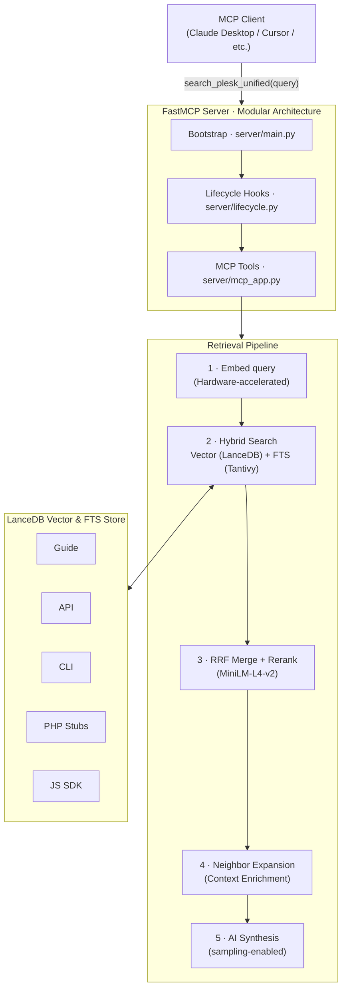

# mcp-plesk-dev-docs

[](https://www.python.org/downloads/)
[](https://pypi.org/project/mcp-plesk-dev-docs/)
[](https://pypi.org/project/mcp-plesk-dev-docs/)
[](https://registry.modelcontextprotocol.io/v0.1/servers/io.github.barateza/mcp-plesk-dev-docs)
[](LICENSE)
[](https://modelcontextprotocol.io/)
[](https://github.com/psf/black)
[](https://github.com/astral-sh/ruff)


**State-of-the-Art (SOTA) semantic search across the entire Plesk documentation surface, optimized for sub-second latency on Apple Silicon.**

---

## Why this exists

Plesk documentation is spread across five separate sources: an admin guide, a REST API reference, a CLI reference, a PHP SDK, and a JS SDK. Answering a single extension development question often means searching all of them manually, cross-referencing results, and still missing the relevant section.

This server ingests all five sources, embeds them with a multilingual model, and exposes a single `search_plesk_unified` MCP tool. It uses hybrid search (Vector + FTS), Reciprocal Rank Fusion (RRF), and Cross-Encoder reranking to deliver high-precision results in milliseconds.

---

## Architecture & Performance



### Performance Benchmarks (2026-05-04)
Optimized for Apple Silicon (M2/M3) using MPS acceleration and memory-resident table caching.

| Profile | Embed Model | HR@5 | MRR@5 | Avg Latency | Est. RAM |
| :--- | :--- | :--- | :--- | :--- | :--- |
| **`light`** | BAAI/bge-small | **100.0%** | **0.917** | **1.007 s** | ~200 MB |
| **`medium`** | BAAI/bge-base | **100.0%** | **0.917** | **~0.60s** | ~600 MB |
| **`full-tq`** | BAAI/bge-m3 | 75.0% | 0.750 | **~0.40s** | ~1300 MB |

*Metrics measured on Apple M2 Pro with LanceDB connection caching enabled.*

---

## Key Features

- **Sub-Second Hybrid Search:** Combined Vector + Tantivy FTS with **RAM-cached table connections** for instant retrieval.
- **AST-Aware Chunking:** Uses `tree-sitter` to respect class and method boundaries in PHP, JS, and TS documentation.
- **TurboQuant Acceleration:** Fast 4-bit quantized search for the `full-tq` profile, delivering 10x lower latency for large models.
- **Neighborhood Retrieval:** Automatically fetches adjacent chunks (prev/next) to provide complete context for grounding.
- **Macro-Context Summaries:** Injects file-level purpose summaries into every chunk using the `SummaryCache`.
- **AI-Synthesized Answers:** Generates concise answers from search results with structured inline citations `[1]`, `[2]`.

---

## MCP Components

This server provides tools, prompts, and resources. See **[docs/mcp-components.md](docs/mcp-components.md)** for a full reference.

### Primary Tools

| Tool | Description |
|---|---|
| `search_plesk_unified` | Hybrid search with RRF and Cross-Encoder reranking. |
| `get_file_content` | Retrieve the full content of a specific documentation file. |
| `resolve_references` | Find all files referencing a specific symbol or topic. |
| `refresh_knowledge` | Re-fetch sources and update the index (incremental). |
| `trigger_index_sync` | Start a background indexing job. |
| `daemon_health` | Check readiness, hardware acceleration (MPS/CUDA), and latency stats. |

### Resources

- `plesk://toc/api` - Table of Contents for API documentation.
- `plesk://toc/cli` - Table of Contents for CLI reference.
- `plesk://toc/guide` - Table of Contents for Extensions Guide.
- `plesk://toc/php-stubs` - Hierarchical list of PHP classes.

---

## Quickstart

### Install

```bash
git clone https://github.com/barateza/mcp-plesk-dev-docs.git
cd mcp-plesk-dev-docs
uv pip install -e .
```

### Initial Indexing

```bash
uv run python -m mcp_plesk_dev_docs.server.main refresh_knowledge
```

### Running

```bash
# Standard mode
uv run python -m mcp_plesk_dev_docs.server.main

# Responsive daemon mode (auto-warmup)
PLESK_DAEMON_AUTO_WARMUP=true uv run python -m mcp_plesk_dev_docs.server.main
```

---

## Configuration

Set environment variables in `.env`:

```env
PLESK_MODEL_PROFILE=light       # light | medium | full-tq
PLESK_ENABLE_SAMPLING=true     # AI-Synthesized answers
PLESK_DAEMON_AUTO_WARMUP=true  # Preload models on startup
PLESK_INDEX_SUMMARIES=true     # Enable file-level summaries
OPENROUTER_API_KEY=sk-or-v1-...
```

---

## Documentation

- **[docs/benchmarks.md](docs/benchmarks.md)** - Detailed latency and quality reports.
- **[docs/mcp-components.md](docs/mcp-components.md)** - Full tool and resource reference.
- **[docs/turboquant.md](docs/turboquant.md)** - 4-bit quantization internals.

---

## License

MIT. See [LICENSE](LICENSE).

## Ownership & Disclaimer

This is a personal project by Gilson Siqueira. It is not officially affiliated with, endorsed by, or supported by Plesk or WebPros International GmbH. Plesk is a trademark of WebPros International GmbH.

Important notice about Plesk-owned deliverables

Portions of this repository were developed under contract for Plesk International GmbH ("Plesk") only if specifically identified as such. The MIT license above applies only to material the repository owner is authorized to license. Files or directories owned by Plesk, if any, are listed in [NOTICE](NOTICE). If you need assurance about licensing for a particular file, contact Plesk or seek legal counsel before relying on the MIT License for Plesk-owned files.

*Built to make Plesk extension development faster.*

<!-- mcp-name: io.github.barateza/mcp-plesk-dev-docs -->
