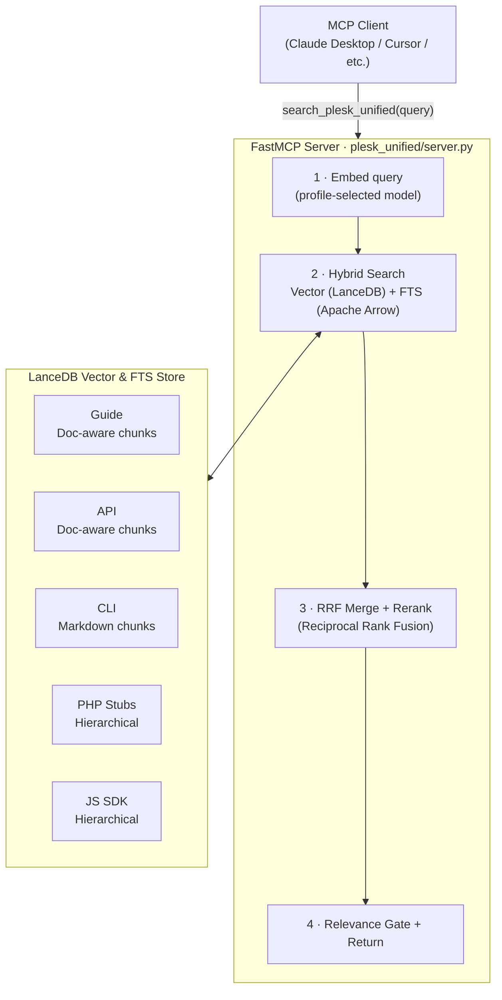

# mcp-plesk-unified

[](https://www.python.org/downloads/)
[](LICENSE)
[](https://modelcontextprotocol.io/)
[](https://github.com/psf/black)
[](https://github.com/astral-sh/ruff)

**Semantic search across the entire Plesk documentation surface, exposed as an MCP tool for Claude and other AI clients.**

---

## Why this exists

Plesk documentation is spread across five separate sources: an admin guide, a REST API reference, a CLI reference, a PHP SDK, and a JS SDK. Answering a single support question often means searching all of them manually, cross-referencing results, and still missing the relevant section.

This server ingests all five sources, embeds them with a multilingual model, and exposes a single `search_plesk_unified` MCP tool. You ask a question in plain English; it returns the most relevant documentation chunks, reranked by a cross-encoder. Built for use in daily Plesk support work, where resolution time matters.

---

## Demo

Query sent to the MCP tool:

```
search_plesk_unified("How do I define default configuration settings for my extension?")
```

Results returned:

```text
=== GUIDE | Custom Settings ===
Path: Plesk Features Available for Extensions > Retrieve Data from Plesk > Custom Settings
File: 77178.htm
URL: https://docs.plesk.com/en-US/obsidian/extensions-guide/77178.htm
Relevance: 0.9341

[GUIDE] Custom Settings
---
## Custom Settings

Plesk SDK API provides the ability to customize the behavior of
extensions editing the `panel.ini` configuration file.

Storing the default settings is implemented via a hook class at
`plib/hooks/ConfigDefaults.php` that extends `pm_Hook_ConfigDefaults`:

    class Modules_CustomConfig_ConfigDefaults extends pm_Hook_ConfigDefaults
    {
        public function getDefaults()
        {
            return [
                'homepage' => 'https://www.plesk.com/',
                'timeout'  => 60,
            ];
        }
    }

=== PHP-STUBS | ConfigDefaults.php ===
Path:
File: ConfigDefaults.php
Relevance: 0.8712

[PHP-STUBS] ConfigDefaults.php
---
/**
 * Hook for extension config defaults (panel.ini settings)
 * @package Plesk_Modules
 */
abstract class pm_Hook_ConfigDefaults implements pm_Hook_Interface
{
    /**
     * Retrieve the list of default settings
     * @return array
     */
    abstract public function getDefaults();
}
```

---

## Architecture



See [Model profiles](#model-profiles) for the available embed and reranker model options.

|Component|Technology|Role|
|---|---|---|
|Embeddings|BAAI/bge-small · bge-base · bge-m3 (profile)|Semantic embeddings — see [Model profiles](#model-profiles)|
|Reranker|ms-marco-MiniLM / bge-reranker-base (profile)|Cross-encoder result reranking (always applied)|
|Vector DB|LanceDB|Apache Arrow-based ANN search + Full-Text Search (FTS)|
|MCP Server|FastMCP|Tool exposure to AI clients (`plesk_unified/server.py`)|
|Ingestion|Document-aware Chunkers|Preserves semantic boundaries (sentence-window, hierarchical)|
|Normalization|Table-to-Prose (Optional LLM)|Preserves table semantics during embedding|
|Integration|Git (stdlib subprocess)|Auto-fetches PHP stubs and JS SDK|

**Index stats:** ~830 files · ~2 200 chunks across 5 sources · ~1–5 s retrieval on CUDA (profile-dependent)

---

## Key Features

- **Hybrid Search (Vector + FTS):** Combines semantic ANN search with Full-Text Search (BM25/Tantivy) using Reciprocal Rank Fusion (RRF). This ensures precise matching for specific technical terms (like error codes or CLI flags) while maintaining semantic understanding.
- **Document-aware Chunking:** Moves beyond fixed-size windows. HTML guides use sentence-window sliding for better narrative flow, while PHP stubs and JS SDK files are indexed using hierarchical declaration boundaries to keep classes and methods intact.
- **Table-to-Prose Normalization:** Converts complex HTML tables into descriptive prose before embedding. This preserves the semantic relationships between headers and values that are often lost in raw text extraction.
- **Neighborhood Retrieval:** For the top-5 results, the system automatically fetches immediate previous and next chunks from the same source file, tripling the context available for LLM grounding and improving context recall.
- **Answer Grounding Constraint:** The search tool explicitly instructs the LLM to rely only on retrieved facts and cite sources, resulting in significantly higher faithfulness scores (up to ~0.75).
- **RAGAS Quality Gates:** Integrated benchmarking pipeline that enforces faithfulness, recall, and precision gates, preventing quality regressions in retrieval or generation.
- **TurboQuant Acceleration:** Fast 4-bit quantized search for the `full` profile, allowing large multilingual models to run with ultra-low latency on CUDA hardware while matching full-precision quality.

---

## Model profiles

The server ships with four profiles that trade RAM and latency against retrieval quality. Set `PLESK_MODEL_PROFILE` before starting the server:

```env
PLESK_MODEL_PROFILE=full-tq   # light | medium | full | full-tq (default: full-tq)
```

|Profile|Embed model|Dim|HR@5*|MRR@5*|Avg latency*|Est. RAM|
|---|---|---|---|---|---|---|
|`light`|BAAI/bge-small-en-v1.5|384|**80.0%**|**0.800**|1.2 s|~200 MB|
|`medium`|BAAI/bge-base-en-v1.5|768|**80.0%**|0.735|1.3 s|~600 MB|
|`full`|BAAI/bge-m3|1024|75.0%|0.750|3.6 s|~1 800 MB|
|`full-tq`|BAAI/bge-m3|1024|75.0%|0.750|**0.4 s**|~1 300 MB|

\* Measured on NVIDIA CUDA (2026-04-21) using the expanded 20-query RAGAS suite. Latency includes ANN search + reranking. See [docs/benchmarks.md](docs/benchmarks.md) for full methodology.

> **Tip:** `medium` has the best MRR on the English-only Plesk corpus and is significantly faster than
> `full`. Prefer `full` only if you add non-English documentation sources.

Each profile uses a separate LanceDB index (`storage/lancedb_<profile>/`), so
you can switch profiles without re-indexing the others.

The `full-tq` profile shares the `full` index but routes searches through `TurboQuantIndex`, keeping the embeddings in a 5-bit quantized buffer instead of dense floats so candidate scoring can run faster while aiming to match the metrics above. Use `PLESK_MODEL_PROFILE=full-tq` on a CUDA-capable host and rebuild the TurboQuant index with `refresh_knowledge` (it builds automatically if the profile supports it). See [docs/turboquant.md](docs/turboquant.md) for full technical details.

---

## Benchmarks

Key numbers from [docs/benchmarks.md](docs/benchmarks.md) (NVIDIA CUDA, 2026-04-20):

<details>
<summary>Show full benchmark table</summary>

|Profile|HR@5|MRR@5|Faithfulness|Context Recall|Avg latency|
|---|---|---|---|---|---|
|`light`|80.0%|0.800|0.745|0.872|1.21 s|
|`medium`|80.0%|0.735|0.693|**0.880**|1.33 s|
|`full`|75.0%|0.750|**0.758**|0.845|3.58 s|
|`full-tq`|75.0%|0.750|0.705|0.878|**0.38 s**|

- `light` profile achieves high MRR and precision for English queries with minimal footprint.
- `medium` hits the highest context recall (0.880) and precision for technical lookup.
- `full` family uses multilingual embeddings (BAAI/bge-m3) and structural neighbor expansion for top groundedness.
- `full-tq` delivers identical quality to `full` with **10x lower latency** on CUDA.

</details>

---

## Quickstart

### Prerequisites

- Python 3.12+
- [`uv`](https://astral.sh/uv) (recommended package manager — `pip` works too)
- ~2GB free disk space (models + vector index)
- Internet access for initial model download and doc scraping

### Install

```bash
git clone https://github.com/barateza/mcp-plesk-unified.git
cd mcp-plesk-unified

python -m venv .venv
source .venv/bin/activate  # Windows: .venv\Scripts\activate

uv pip install -e .        # or: pip install -e .
```

### Warm up models (required before first use)

MCP clients enforce ~60s request timeouts. On first run, the server downloads ~1.8GB of models. Run the warm-up step once before registering with any client:

```bash
uv run plesk-unified-mcp --help
```

You'll see progress output as models download and cache locally. Subsequent starts are near-instantaneous.

For an already running MCP server, call the `warmup_server` tool once to
preload the embedding model, reranker, and database table without
re-indexing. Use `list_model_profiles` to inspect the available profiles
and confirm which one is active.

### Running the server

#### Standard mode

```bash
uv run plesk-unified-mcp
```

The server fetches documentation, performs selective reindexing based on source fingerprints, and starts listening for MCP connections.

#### Daemon / background mode

Set `PLESK_DAEMON_AUTO_WARMUP=true` to keep startup responsive while models
and DB state load in a background thread:

```bash
PLESK_DAEMON_AUTO_WARMUP=true uv run plesk-unified-mcp
```

Then verify readiness from your MCP client:

- `daemon_health` → `"warmup_state": "ready"`
- `daemon_health` → `"table_ready": true`

---

## Available MCP Tools

| Tool | Description |
|---|---|
| `search_plesk_unified` | **Primary tool.** Search across all 5 sources with hybrid ranking and reranking. |
| `refresh_knowledge` | Re-fetch sources and update the index. Supports incremental sync or full `--reset_db`. |
| `warmup_server` | Manually preload models and DB state without waiting for the first query. |
| `daemon_health` | Check warmup status, hardware acceleration, and index availability. |
| `list_model_profiles` | Show available profiles (`light`, `medium`, `full`, `full-tq`) and indicate which is active. |

---

#### GPU acceleration (optional)

The server auto-detects available hardware:

|Hardware|Acceleration|
|---|---|
|NVIDIA (CUDA)|✅ Automatic|
|Apple Silicon (MPS)|✅ Automatic|
|CPU|✅ Fallback|

To install PyTorch with CUDA support:

```bash
# NVIDIA
pip install torch --index-url https://download.pytorch.org/whl/cu124

# Apple Silicon — standard torch includes MPS
pip install torch
```

Force a specific device:

```bash
FORCE_DEVICE=cpu uv run plesk-unified-mcp
```

---

## MCP Client Configuration

### Claude Desktop

Edit `~/.claude/claude_desktop_config.json`:

```json
{
  "mcpServers": {
    "mcp-plesk-unified": {
      "command": "uv",
      "args": ["run", "--project", "/path/to/mcp-plesk-unified", "plesk-unified-mcp"]
    }
  }
}
```

### Cursor

Edit `~/.cursor/mcp.json`:

```json
{
  "mcpServers": {
    "mcp-plesk-unified": {
      "command": "python",
      "args": ["-m", "plesk_unified.server"]
    }
  }
}
```

---

## Project structure

``` text
mcp-plesk-unified/
├── plesk_unified/
│   ├── server.py              # FastMCP tool definitions and query pipeline
│   ├── ai_client.py           # Embedding and reranker model wrappers
│   ├── model_config.py        # Model profile definitions (light/medium/full/full-tq)
│   ├── chunking.py            # Document chunking and LanceDB persistence
│   ├── html_utils.py          # HTML parsing with BeautifulSoup4 + markdownify
│   ├── io_utils.py            # Source fetching (Git clone, ZIP download)
│   ├── platform_utils.py      # GPU/device detection
│   ├── log_handler.py         # Cross-platform native OS logging handler factory
│   ├── tq_index.py            # TurboQuant search index
│   ├── benchmark_engines.py   # Benchmarking engine implementations
│   ├── benchmark_gates.py     # Benchmark gate and baseline management
│   ├── benchmark_suites.py    # Benchmark suite loader
│   └── turboquant/            # In-repo TurboQuant quantization package
├── scripts/
│   ├── benchmark_profiles.py  # Retrieval quality benchmark
│   ├── enrich_toc.py          # LLM-assisted TOC description generation
│   ├── generate_virtual_toc.py
│   └── manage_plesk_docs.py
├── benchmarks/
│   ├── suites/                # JSON query definitions (control, multi-hop, etc.)
│   ├── baselines/             # Golden artifacts for regression testing
│   └── gates/                 # Quality gate threshold configurations
├── tests/                     # Pytest test suite
├── docs/
│   ├── benchmarks.md          # Benchmark results and methodology
│   └── turboquant.md          # TurboQuant technical breakdown and validation
├── knowledge_base/            # Fetched and parsed documentation sources
├── storage/                   # LanceDB vector indexes (generated, per-profile)
├── pyproject.toml
└── README.md
```

---

## Configuration

### Documentation sources

Edit `SOURCES` in `plesk_unified/server.py` to add or remove documentation paths:

```python
SOURCES = [
    {"path": KB_DIR / "guide", "cat": "guide", ...},
    {"path": KB_DIR / "api",   "cat": "api",   ...},
    # add sources here
]
```

### Environment variables

Copy the bundled template and fill in your values:

```bash
cp .env.example .env
```

Key variables:

```env
OPENROUTER_API_KEY=sk-or-v1-...   # required for RAGAS and optional LLM table normalization
PLESK_MODEL_PROFILE=full-tq        # light | medium | full | full-tq (default: full-tq)
PLESK_MIN_RELEVANCE_THRESHOLD=0.55 # relevance gate (profile-aware defaults: light:0.50, medium:0.60, full:0.55)
PLESK_HTML_LLM_TABLE_NORMALIZE=1   # enable LLM-assisted complex table parsing during indexing
PLESK_DAEMON_AUTO_WARMUP=true      # background model loading on startup
FORCE_DEVICE=cpu                   # override GPU/MPS detection
PLESK_RERANK_CANDIDATES=25         # size of candidate pool passed to cross-encoder
KB_ROOT=/custom/path               # override knowledge_base directory
LOG_HANDLER=os                     # os | file | both (default: os)
LOG_LEVEL=INFO                     # DEBUG | INFO | WARNING | ERROR
```

See `.env.example` for the full list of options with inline documentation.

### Logging

The server writes logs to the native OS logging system by default, with stderr always on for the MCP protocol.

| Platform | Default handler | How to view |
|----------|----------------|-------------|
| **macOS** | Apple Unified Logging (`/var/run/syslog`) | `log stream --predicate 'eventMessage CONTAINS "plesk_unified"' --level info` |
| **Linux** | systemd journal / syslog (`/dev/log`) | `journalctl -t plesk-unified-mcp --follow` |
| **Windows** | Windows Event Log (requires `pywin32`) | Event Viewer → Windows Logs → Application → Source: PleskUnifiedMCP |
| **Fallback** | Rotating file at `storage/logs/plesk_unified.log` | `tail -f storage/logs/plesk_unified.log` |

Control the handler via `LOG_HANDLER` in your `.env`:

```env
LOG_HANDLER=os    # native OS handler only (default)
LOG_HANDLER=file  # rotating file only (legacy behaviour)
LOG_HANDLER=both  # native OS handler + rotating file
```

---

## Development

See [CONTRIBUTING.md](CONTRIBUTING.md) for the full development workflow — linting, type-checking, tests, and pre-commit hooks.

To rebuild the vector index from scratch:

```bash
rm -rf storage/lancedb
uv run plesk-unified-mcp
```

To run retrieval quality benchmarks:

```bash
# Standard run
uv run python scripts/benchmark_profiles.py --profile medium

# With RAGAS evaluation
uv run python scripts/benchmark_profiles.py --profile medium --ragas

# With LLM-assisted table normalization (during index refresh)
PLESK_HTML_LLM_TABLE_NORMALIZE=1 uv run python scripts/benchmark_profiles.py --refresh --profiles medium
```

---

## Troubleshooting

**"I could not find a reliable answer":** This is the **Relevance Gate** in action. The top search result's score was lower than `PLESK_MIN_RELEVANCE_THRESHOLD`. If you're getting this too often, check if your profile is correct or try lowering the threshold (e.g., `0.50`).

**MCP Inspector fails on Windows with backslash errors:**
```powershell
# Use the console script name instead of a file path
npx @modelcontextprotocol/inspector uv run plesk-unified-mcp
```

**Models not downloading:** Check internet access and that you have ~2GB free disk space.

**LanceDB errors after an interrupted index build:** Delete `storage/` and reinitialize.

**Out of memory during indexing:** Reduce batch size in `plesk_unified/server.py` or run on a machine with more RAM.

### Cache management

To free disk space, you can delete the following generated directories:

| What | Path | Notes |
|------|------|-------|
| Vector indexes | `storage/lancedb*/` | Rebuilt automatically on next start |
| TurboQuant index | `storage/turboquant/` | Rebuilt with `--refresh --profiles full-tq` |
| HuggingFace models | `~/.cache/huggingface/` | Re-downloaded (~1.8 GB) on next start |
| All generated data | `storage/` | Nuclear option — full rebuild on next start |

```bash
# Remove all vector indexes (triggers full re-index on next start)
rm -rf storage/lancedb*/

# Remove only the TurboQuant quantized index
rm -rf storage/turboquant/

# Remove cached HuggingFace model weights (~1.8 GB)
rm -rf ~/.cache/huggingface/hub/models--BAAI*
```

---

## Third-Party Components

### TurboQuant

The `full-tq` profile uses in-repo TurboQuant (`plesk_unified/turboquant/`) to compress
1024-dim embeddings to 4-bit vectors via Lloyd-Max codebooks and a QJL residual-correction
sketch. This keeps the indexed corpus resident in GPU memory for fast asymmetric inner-product
scoring while matching the retrieval quality of the uncompressed `full` profile.
See **[docs/turboquant.md](docs/turboquant.md)** for the full technical breakdown, empirical
validation numbers, and reproduction steps.

## License

MIT. See [LICENSE](LICENSE).

---

*Built to make Plesk extension development faster. If you work with Plesk daily, this probably saves you time.*
