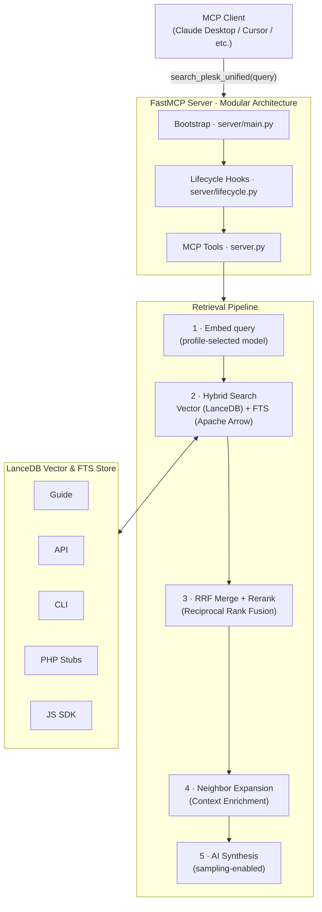

# mcp-plesk-unified

[](https://www.python.org/downloads/)
[](LICENSE)
[](https://modelcontextprotocol.io/)
[](https://github.com/psf/black)
[](https://github.com/astral-sh/ruff)

**Semantic search across the entire Plesk documentation surface, exposed as an MCP tool for Claude and other AI clients.**

---

## Why this exists

Plesk documentation is spread across five separate sources: an admin guide, a REST API reference, a CLI reference, a PHP SDK, and a JS SDK. Answering a single support question often means searching all of them manually, cross-referencing results, and still missing the relevant section.

This server ingests all five sources, embeds them with a multilingual model, and exposes a single `search_plesk_unified` MCP tool. You ask a question in plain English; it returns the most relevant documentation chunks, reranked by a cross-encoder. Built for use in daily Plesk support work, where resolution time matters.

---

## Demo

Query sent to the MCP tool:

```
search_plesk_unified("How do I define default configuration settings for my extension?")
```

Results returned:

```text
### AI-Synthesized Answer

To define default configuration settings for a Plesk extension, you should implement a hook class at `plib/hooks/ConfigDefaults.php` that extends `pm_Hook_ConfigDefaults`. In this class, you must implement the `getDefaults()` method which returns an associative array of your settings. For example:

```php
class Modules_CustomConfig_ConfigDefaults extends pm_Hook_ConfigDefaults
{
    public function getDefaults()
    {
        return [
            'homepage' => 'https://www.plesk.com/',
            'timeout'  => 60,
        ];
    }
}
```

---

### [GUIDE] Custom Settings
**File:** `77178.htm` | **Path:** Plesk Features Available for Extensions > Retrieve Data from Plesk > Custom Settings | **Score:** 0.9341
**Documentation:** https://docs.plesk.com/en-US/obsidian/extensions-guide/77178.htm

## Custom Settings
Plesk SDK API provides the ability to customize the behavior of extensions editing the `panel.ini` configuration file...
```

---

## Architecture



See [Model profiles](#model-profiles) for the available embed and reranker model options.

|Component|Technology|Role|
|---|---|---|
|Embeddings|BAAI/bge-small · bge-base · bge-m3 (profile)|Semantic embeddings — see [Model profiles](#model-profiles)|
|Reranker|ms-marco-MiniLM / bge-reranker-base (profile)|Cross-encoder result reranking (always applied)|
|Vector DB|LanceDB|Apache Arrow-based ANN search + Full-Text Search (FTS)|
|MCP Server|FastMCP|Modular server with tools, prompts, and resources|
|Ingestion|Document-aware Chunkers|Preserves semantic boundaries (sentence-window, hierarchical)|
|Normalization|Table-to-Prose (Optional LLM)|Preserves table semantics during embedding|
|Summarization|SummaryCache (Optional LLM)|Generates macro-context descriptions for files|

**Index stats:** ~830 files · ~2 200 chunks across 5 sources · ~0.4–3 s retrieval on CUDA (profile-dependent)

---

## Key Features

- **Hybrid Search (Vector + FTS):** Combines semantic ANN search with Full-Text Search (BM25/Tantivy) using Reciprocal Rank Fusion (RRF).
- **AI-Synthesized Answers:** Automatically generates a concise answer from the top search results using LLM sampling (requires `PLESK_ENABLE_SAMPLING=true`).
- **Document-aware Chunking:** HTML guides use sentence-window sliding; PHP stubs and JS SDK files use hierarchical declaration boundaries.
- **Table-to-Prose Normalization:** Converts complex HTML tables into descriptive prose before embedding to preserve semantics.
- **Neighborhood Retrieval:** Automatically fetches adjacent chunks (prev/next) for the top results to triple the context available for grounding.
- **Macro-Context Summaries:** Optionally generates and caches file-level summaries to enrich every chunk with document-wide purpose.
- **Async Indexing:** Trigger and monitor indexing jobs in the background without blocking the MCP server.
- **TurboQuant Acceleration:** Fast 4-bit quantized search for the `full` profile, delivering 10x lower latency on CUDA.

---

## MCP Components

This server provides tools, prompts, and resources to AI clients. See **[docs/mcp-components.md](docs/mcp-components.md)** for a full reference.

### Primary Tools

| Tool | Description |
|---|---|
| `search_plesk_unified` | Search across all 5 sources with hybrid ranking and reranking. |
| `refresh_knowledge` | Re-fetch sources and update the index. Supports incremental sync. |
| `trigger_index_sync` | Start a background indexing job (returns `job_id`). |
| `check_sync_status` | Check the status of a background indexing job. |
| `warmup_server` | Preload models and DB state without waiting for the first query. |
| `daemon_health` | Check readiness status, hardware acceleration, and index availability. |

### Prompts

| Prompt | Use Case |
|---|---|
| `plesk-extension-dev-guide` | Starter guide for developing a new Plesk extension. |
| `plesk-api-integration` | Integration details for a specific Plesk API operation. |
| `plesk-cli-reference` | Detailed reference for a Plesk CLI command. |

### Resources

- `plesk://toc/api` - Table of Contents for API documentation.
- `plesk://toc/cli` - Table of Contents for CLI reference.
- `plesk://toc/guide` - Table of Contents for Extensions Guide.
- `plesk://toc/php-stubs` - Hierarchical list of PHP classes and methods.
- `plesk://toc/js-sdk` - Hierarchical list of JS SDK components.

---

## Tooling Utilities

The project includes several utility scripts for maintenance and verification:

- `verify_refresh.py`: Confirms that incremental indexing correctly skips unchanged sources based on fingerprints.
- `scripts/enrich_toc.py`: Uses an LLM to generate one-sentence descriptions for files in the `php-stubs` and `js-sdk` categories.
- `scripts/backfill_summary_cache.py`: Populates the `SummaryCache` from existing LanceDB entries.
- `scripts/generate_virtual_toc.py`: Generates hierarchical TOC maps for code-based documentation sources.

---

## Model profiles

Set `PLESK_MODEL_PROFILE` before starting the server:

```env
PLESK_MODEL_PROFILE=full-tq   # light | medium | full | full-tq (default: full-tq)
```

|Profile|Embed model|Dim|HR@5*|MRR@5*|Avg latency*|Est. RAM|
|---|---|---|---|---|---|---|
|`light`|BAAI/bge-small-en-v1.5|384|**80.0%**|**0.800**|1.2 s|~200 MB|
|`medium`|BAAI/bge-base-en-v1.5|768|**80.0%**|0.735|1.3 s|~600 MB|
|`full`|BAAI/bge-m3|1024|75.0%|0.750|3.6 s|~1 800 MB|
|`full-tq`|BAAI/bge-m3|1024|75.0%|0.750|**0.4 s**|~1 300 MB|

\* Measured on NVIDIA CUDA (2026-04-21). See [docs/benchmarks.md](docs/benchmarks.md) for details.

---

## Quickstart

### Install

```bash
git clone https://github.com/barateza/mcp-plesk-unified.git
cd mcp-plesk-unified
uv pip install -e .
```

### Warm up & Index

```bash
uv run python -m plesk_unified.server.main refresh_knowledge # Initial index
```

### Running

```bash
# Standard mode
uv run python -m plesk_unified.server.main

# Responsive daemon mode (background warmup)
PLESK_DAEMON_AUTO_WARMUP=true uv run python -m plesk_unified.server.main
```

---

## Configuration

Copy `.env.example` to `.env` and configure:

```env
PLESK_MODEL_PROFILE=full-tq
PLESK_ENABLE_SAMPLING=true         # Enable AI-Synthesized answers
PLESK_DAEMON_AUTO_WARMUP=true      # Responsive startup
PLESK_INDEX_SUMMARIES=true         # Enable macro-context descriptions
OPENROUTER_API_KEY=sk-or-v1-...   # Required for sampling/summaries
LOG_HANDLER=os                     # os | file | both
```

---

## Logging

| Platform | Handler | View Command |
|----------|---------|--------------|
| **macOS** | Apple Unified Logging | `log stream --predicate 'eventMessage CONTAINS "plesk_unified"'` |
| **Linux** | systemd journal | `journalctl -t plesk-unified --follow` |
| **Windows** | Windows Event Log | Event Viewer → Application → Source: PleskUnifiedMCP |

---

## License

MIT. See [LICENSE](LICENSE).

---

*Built to make Plesk extension development faster.*
