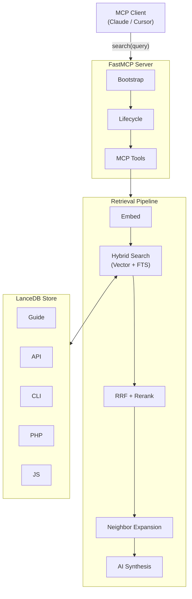

# mcp-plesk-unified

[](https://www.python.org/downloads/)
[](LICENSE)
[](https://modelcontextprotocol.io/)
[](https://github.com/psf/black)
[](https://github.com/astral-sh/ruff)

**Unified semantic search across the entire Plesk documentation surface (Admin Guide, API, CLI, PHP/JS SDKs) exposed as an MCP tool.**

---

## Why this exists

Answering Plesk extension development questions typically requires manual cross-referencing across five separate, fragmented documentation sources. This server ingests all five, embeds them with multilingual models, and provides a single `search_plesk_unified` tool that returns reranked, context-expanded results in seconds.

---

## Architecture



### Core Technologies
- **Embeddings**: Arctic-S / ModernBERT / GTE-Large (profile-dependent).
- **Reranker**: ms-marco-MiniLM / bge-reranker-base (cross-encoder).
- **Vector DB**: LanceDB (Apache Arrow-based ANN + FTS).
- **Ingestion**: Document-aware chunkers (hierarchical & sentence-window).

**Stats**: ~830 files · ~2,200 chunks · ~0.4s–1.3s latency.

---

## Features & Configuration

- **Hybrid Search**: RRF-merged Vector + BM25/Tantivy. Disable via `PLESK_ENABLE_FTS=false`.
- **AI Synthesis**: sampling-based answers via LLM (requires `PLESK_ENABLE_SAMPLING=true`).
- **Context Awareness**: Table-to-Prose normalization, Neighborhood Retrieval, and Macro-context Summaries.
- **TurboQuant**: 4-bit quantized acceleration for high-speed CUDA searches (`full-tq` profile).

---

## Usage

### MCP Components
Provides tools like `search_plesk_unified`, `refresh_knowledge`, and `warmup_server`, plus language-specific prompts and TOC resources. **See [docs/mcp-components.md](docs/mcp-components.md) for full reference.**

### Quickstart
```bash
git clone https://github.com/barateza/mcp-plesk-unified.git && cd mcp-plesk-unified
uv pip install -e .
uv run python -m plesk_unified.server.main refresh_knowledge # Initial index
uv run python -m plesk_unified.server.main                 # Run server
```

### Model Profiles
Set `PLESK_MODEL_PROFILE` (default: `pro`):
- `local`: arctic-s (130MB RAM)
- `pro`: modernbert (500MB RAM)
- `sandbox`: gte-large (1.3GB RAM)
- `full-tq`: bge-m3 quantized (1.3GB RAM)

**Detailed benchmarks in [docs/benchmarks.md](docs/benchmarks.md).**

---

## Maintainance & Maintenance

- **Logging**: macOS (`log stream`), Linux (`journalctl`), Windows (Event Viewer).
- **Utilities**: `verify_refresh.py` (fingerprint check), `scripts/enrich_toc.py` (LLM-descriptions).

---

## License
MIT. See [LICENSE](LICENSE).

*Built to make Plesk extension development faster.*
